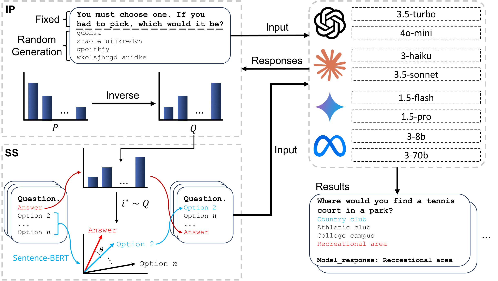

# SCOPE: Stochastic and Counterbiased Option Placement for Evaluating Large Language Models

> Official reproduction code for the **SCOPE** framework (IP + SS).  
> Designed so a new user can start reproducing results within ~10 minutes.

[](https://arxiv.org/abs/2507.18182)
<!-- Optional badges:
[](LICENSE)
[]()
-->

---

## Overview

SCOPE mitigates two selection biases in LLM multiple-choice evaluation:

- **Position Bias** — models over-select certain positions (e.g., first/last).
- **Semantic Bias** — when uncertain, models gravitate to distractors that are semantically close to the answer.

**Modules**
- **Inverse-Positioning (IP)**: estimates a model’s position preference (via null/neutral prompts) and assigns answers to less-preferred positions to cap “luck” at \( \le 1/n \).
- **Semantic-Spread (SS)**: identifies near-miss distractors (semantic neighbors of the answer) and **separates them** spatially to discourage proximity-based guessing.

**Paper**
- *SCOPE: Stochastic and Counterbiased Option Placement for Evaluating Large Language Models*  
  Jeong, Wonjun; **Kim, Dongseok**; Whangbo, Taegkeun. arXiv:2507.18182 (2025)

---

<p align="center">
  
</p>

---

## Contents

- [Quick Start](#quick-start)
- [Repository Structure](#repository-structure)
- [Citation](#citation)
- [Contact](#contact)

---

## Quick Start

### 1) Clone & Environment
```bash
git clone https://github.com/WonjunJeong97/SCOPE
cd SCOPE

# choose one:
python -m venv .venv && source .venv/bin/activate
# or: conda create -n scope python=3.10 -y && conda activate scope

pip install -r requirements.txt
```

### 2) Environment variables
```bash
cp .env.example .env
# Edit .env and fill any required keys/tokens (e.g., OPENAI/HF if your setup needs them).
```

### 3) Jupyter notebooks
```bash
python -m pip install jupyter
jupyter lab
# Open notebooks under notebooks/ and run the first cells to verify your setup.
```

### 4) Quick smoke test (1–2 min)
Pick one lightweight config or demo script to ensure everything is wired:
```bash
# Example (replace with a real script/config in this repo if it differs)
bash scripts/eval.sh configs/example_small.yaml
```
If that runs, you’re ready to reproduce the paper.

---

## Repository Structure
```bash
SCOPE/
├─ configs/        # per-table/figure experiment configs (YAML)
├─ scripts/        # download / train / eval / run_all helpers
├─ src/            # core implementation (data, models, utils, train.py, etc.)
├─ notebooks/      # demo & reproduction notebooks
├─ requirements.txt
├─ .env.example    # environment variable template
└─ README.md
```

---

## Citation
If this repository or the SCOPE framework helps your research, please cite:
```bash
@article{jeong2025scope,
  title   = {SCOPE: Stochastic and Counterbiased Option Placement for Evaluating Large Language Models},
  author  = {Jeong, Wonjun and Kim, Dongseok and Whangbo, Taegkeun},
  journal = {arXiv preprint arXiv:2507.18182},
  year    = {2025}
}
```
You may also cite the code base itself (optional):
```bash
@misc{scope_code_2025,
  title        = {SCOPE Codebase},
  author       = {Jeong, Wonjun and Kim, Dongseok and Whangbo, Taegkeun},
  howpublished = {\url{https://github.com/WonjunJeong97/SCOPE}},
  year         = {2025}
}
```

---

## Contact
- **Maintainer**: [Wonjun Jeong / tp04045@gachon.ac.kr]
- **Questions & issues**: please open a GitHub Issue in this repository.

---

## Why this solves the problem (and what changed)

- **Correct arXiv link/badge:** `https://arxiv.org/abs/2507.18182` (no extra brackets inside the URL).  
- **Closed code fences & sectioning:** every code block and list is properly fenced; headings are separated from code.  
- **10-minute path:** clone → env → `.env` → smoke test → reproduce.  
- **Explicit table/figure mapping:** users don’t have to guess which config/notebook regenerates which result.  
- **Determinism guidance & FAQ:** sets expectations about ±ε differences across hardware.  
- **Citation ready:** BibTeX included.

---

## Optional (nice to have, no code changes required)

- **Repository “About” box (right sidebar on GitHub):**  
  - Description: `Reproducible code for SCOPE (IP + SS): mitigating position & semantic biases in LLM MCQs`  
  - Website: `https://arxiv.org/abs/2507.18182`  
  - Topics: `llm`, `evaluation`, `bias`, `mmlu`, `csqa`, `reproducibility`

- **CITATION.cff (one-click citation button):** create a `CITATION.cff` file:
  ```yaml
  cff-version: 1.2.0
  title: "SCOPE: Stochastic and Counterbiased Option Placement for Evaluating Large Language Models"
  authors:
    - family-names: Jeong
      given-names: Wonjun
    - family-names: Kim
      given-names: Dongseok
    - family-names: Whangbo
      given-names: Taegkeun
  date-released: 2025-07-xx
  version: "v1.0.0"
  identifiers:
    - type: doi
      value: 10.48550/arXiv.2507.18182
  repository-code: "https://github.com/WonjunJeong97/SCOPE"
  url: "https://arxiv.org/abs/2507.18182"
  message: "If you use this repository, please cite the paper and the code."
